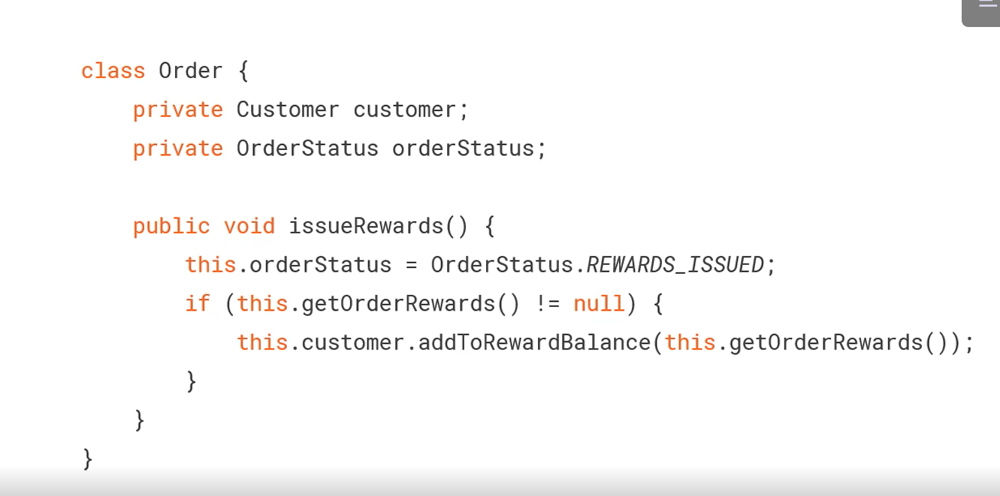
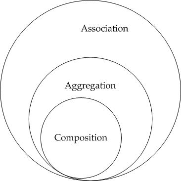
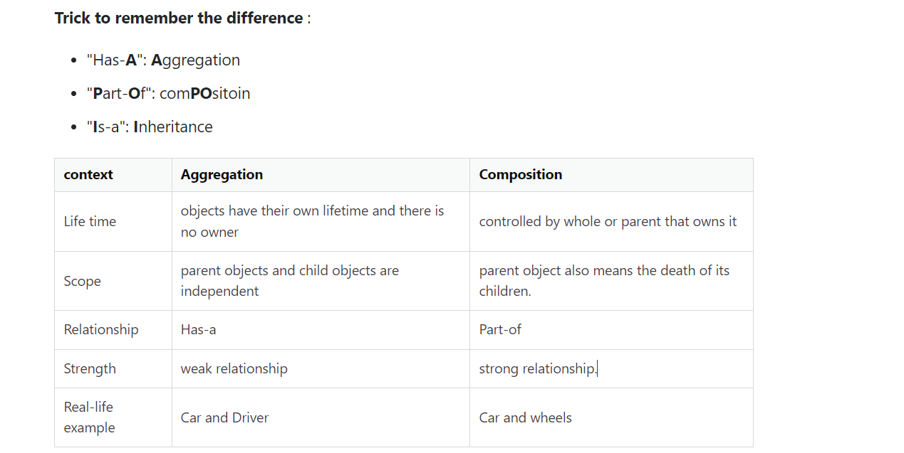

# functionalprogramming

In imperative coding we do how to do it
In functional programming we only care what to do not how

## Impure functions
Math.random(); //0.03
Math.random(); //0.71

## Pure functions
Math.sqrt(81); //9
Math.sqrt(81); //9

## Immutability
Below is mutable code

Below is immutable code

## Why functional programming matters
## Memoization

## Avoid void functions
1) Write immutable(dont change the state of the input parameters)/pure functions

## Lazy evaluation

Caller code has to now call both the methods

The customer reference is used only in updateRewardBalance, then
we can move the customer as parameter

## Side effect
In the below example issueReward is adding customers reward balance

check below, if we do customer.getRewardBalance() it will be 10 first time
and then after issueReward call the same will be 15 thats a side effect

## To Achieve Referential transparency we need immutable data

## Functional programming

Five main functional interfaces

## High order functions

## Point free programming

Aggregation vs composition

## Closure

## Currying

